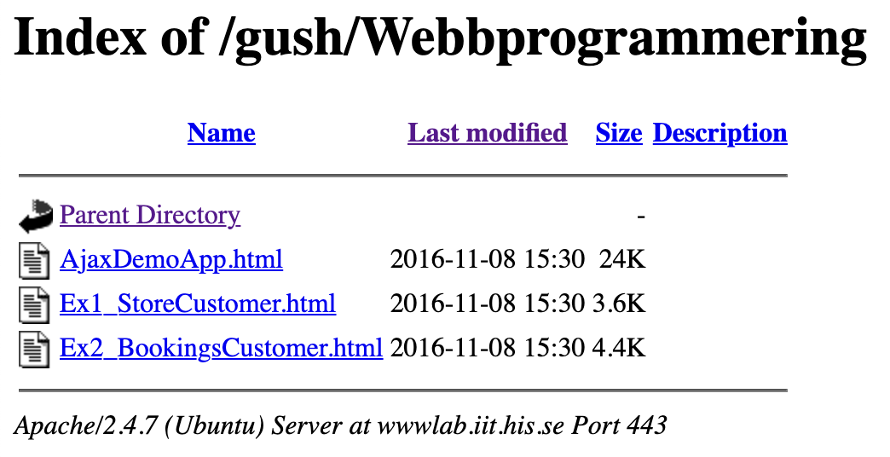

# FileLister

Apache has built-in listing of directories if there is no index.php or similar file in a folder. 
This functionality however uses a slightly dated style, and requires one to click on files to open them.

FileLister is a sortable directory list-plugin and file previewer for Apache.
Primarily designed for previewing images, html, php etc inline.

